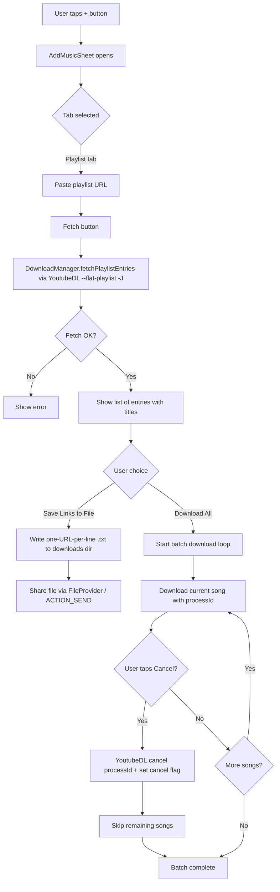

# Playlist Import Feature — Architecture Plan

## Goal

Add a new option to the `+` (Add Music) sheet that lets the user paste a YouTube playlist URL, extract the individual song links, and either:

1. **Save the links to a file** (so the user can share the links file), or
2. **Download all songs** into the library, with the ability to **cancel midway** (cancels the current download and skips all remaining songs in the batch).

## Confirmed Design Decisions

- **Extraction method:** YoutubeDL `--flat-playlist -J` (reliable, already a dependency, returns titles + URLs).
- **Cancel behavior:** Cancel everything — stop the current download and skip all remaining songs in the batch.
- **Link file format:** One URL per line (already compatible with the existing [`MainViewModel.downloadSong()`](app/src/main/java/com/Music/MainViewModel.kt:342) parser, which splits on `[\n,]`).

## Workflow

## File-by-File Changes

### 1. [`app/src/main/java/com/Music/downloader/DownloadManager.kt`](app/src/main/java/com/Music/downloader/DownloadManager.kt)

- Add `data class PlaylistEntry(val url: String, val title: String, val index: Int)`.
- Add `suspend fun fetchPlaylistEntries(playlistUrl: String): List<PlaylistEntry>` — runs `YoutubeDLRequest` with `--flat-playlist`, `-J`, dumps JSON, parses `entries[]` and builds canonical `https://www.youtube.com/watch?v=<id>&list=<listId>&index=<n>` URLs. Only entries that produce a valid `watch?v=` URL are returned (this satisfies the "only links that contain index=some number" requirement — we construct them with the index).
- Modify `downloadSong(url, taskId, onProgress)` → `downloadSong(url, taskId, processId, onProgress)` so a stable `processId` is passed to `YoutubeDL.getInstance().execute(request, processId)`. The existing single-song path passes a generated processId (e.g. `taskId`).
- Add `fun cancelDownload(processId: String)` → `YoutubeDL.getInstance().cancel(processId)` (best-effort, ignore if not running).

### 2. [`app/src/main/java/com/Music/data/MusicRepository.kt`](app/src/main/java/com/Music/data/MusicRepository.kt)

- Add `suspend fun fetchPlaylistEntries(playlistUrl: String): List<PlaylistEntry>` delegating to `downloadManager`.
- Add `suspend fun saveLinksToFile(entries: List<PlaylistEntry>, playlistUrl: String): File` — writes one URL per line to `context.getExternalFilesDir(null)/downloads/<safeName>_links.txt`. Returns the `File` so the ViewModel can share it.
- Update `downloadAndSave(...)` to accept an optional `processId` and forward it to `downloadManager.downloadSong`. Keep backward compatibility for the existing single-song call site (generate a processId from `taskId` when not provided).

### 3. [`app/src/main/java/com/Music/MainViewModel.kt`](app/src/main/java/com/Music/MainViewModel.kt)

New state:
- `data class PlaylistFetchState(val isLoading: Boolean = false, val entries: List<PlaylistEntry> = emptyList(), val error: String? = null)`
- `_playlistFetch` `MutableStateFlow<PlaylistFetchState>` + public `playlistFetch`.
- `data class BatchDownloadState(val total: Int = 0, val completed: Int = 0, val currentTitle: String? = null, val currentProgress: Float = 0f, val isRunning: Boolean = false, val isCancelling: Boolean = false)`
- `_batchDownload` `MutableStateFlow<BatchDownloadState>` + public `batchDownload`.
- `private var batchCancelFlag = false` and `private var currentProcessId: String? = null`.

New functions:
- `fun fetchPlaylistLinks(url: String)` — sets loading, calls `repository.fetchPlaylistEntries`, updates state, emits errors via `_errorEvents`.
- `fun clearPlaylistFetch()` — resets the fetch state.
- `fun saveAndShareLinksFile(context: Context)` — writes the currently fetched entries to a file via repository, then builds an `ACTION_SEND` intent with `FileProvider` and emits a share intent event (or directly starts the share — see wiring note below). Reuses the existing FileProvider authority `${packageName}.provider`.
- `fun downloadPlaylistSongs()` — iterates over `playlistFetch.entries`; for each, checks `batchCancelFlag`; if not cancelled, generates a `processId`, stores it in `currentProcessId`, calls `repository.downloadAndSave(url, taskId, processId, ...)` updating `_batchDownload` per song and per progress. Skips songs already in the library (reuse `repository.isSongDownloaded`). On finish or cancel, resets `_batchDownload`.
- `fun cancelPlaylistDownload()` — sets `batchCancelFlag = true`, calls `repository.downloadManager.cancelDownload(currentProcessId)` (expose a passthrough or call via repository), updates state to `isCancelling = true`. The loop checks the flag before starting each next song and exits.

### 4. [`app/src/main/java/com/Music/LibraryScreen.kt`](app/src/main/java/com/Music/LibraryScreen.kt)

- In `LibraryScreen`, collect `viewModel.playlistFetch` and `viewModel.batchDownload`.
- Extend the `AddMusicSheet` call site to pass new callbacks: `onFetchPlaylist`, `onSaveLinks`, `onDownloadPlaylist`, `onCancelPlaylist`, plus the two state objects.
- In `AddMusicSheet`:
  - Change the tab list from `["Download", "File", "Folder"]` to `["Download", "Playlist", "File", "Folder"]`.
  - Add a new `when (t)` branch `1 ->` for the Playlist tab containing:
    - `OutlinedTextField` for the playlist URL (placeholder: `Paste YouTube playlist URL`).
    - **Fetch** button → `onFetchPlaylist(urlText)`.
    - When `playlistFetch.entries` is non-empty: show a small header `N songs found` and a preview list (title + index, capped at ~10 rows with a `+N more` line).
    - Two action buttons side by side:
      - **Save Links** (icon `FileDownload`/`Save`) → `onSaveLinks()`. Disabled while entries empty.
      - **Download All** (icon `Download`) → `onDownloadPlaylist()`. Disabled while entries empty or batch running.
    - When `batchDownload.isRunning`: show a `LinearProgressIndicator` (`completed/total`), the current song title + percent, and a **Cancel** button (icon `Cancel`) → `onCancelPlaylist()`. While `isCancelling`, show "Cancelling..." and disable Download All.
  - Renumber the existing File/Folder branches to `2` and `3`.

### 5. Sharing the links file

- The existing FileProvider ([`AndroidManifest.xml`](app/src/main/AndroidManifest.xml:48)) covers `external-files-path` ([`file_paths.xml`](app/src/main/res/xml/file_paths.xml:1)), which already includes the `downloads` subdirectory used by `DownloadManager`. No manifest change needed.
- The ViewModel will expose a `SharedFlow<Intent>` (e.g. `_shareIntents`) that the `LibraryScreen` collects and calls `context.startActivity(Intent.createChooser(intent, ...))`. This keeps the ViewModel Android-context-light (it already holds `application` via `AndroidViewModel`, but using a SharedFlow is cleaner and matches the existing `_errorEvents` pattern).

### 6. Link file format compatibility

- The existing [`MainViewModel.downloadSong()`](app/src/main/java/com/Music/MainViewModel.kt:342) splits pasted text on `Regex("[\\n,]")` and trims/dedupes. A `.txt` with **one URL per line** is therefore directly consumable: a user could later paste the file's contents back into the Download tab.
- The saved file will contain **only** the canonical `https://www.youtube.com/watch?v=...&list=...&index=N` URLs, one per line, in playlist order. No headers, no JSON, no extra formatting — this guarantees each line is independently parseable as a single song.
- Document this format in a comment at the top of `saveLinksToFile` and in the plan.

## Edge Cases Handled

- Playlist URL without `list=` parameter → `fetchPlaylistEntries` returns empty / throws a clear error.
- Private/age-restricted playlists → YoutubeDL error surfaced via `_errorEvents`.
- Duplicate songs already in library → skipped during batch download (reuses `repository.isSongDownloaded`).
- Cancel pressed between songs → flag checked before next iteration, loop exits cleanly.
- Cancel pressed during a download → `YoutubeDL.cancel(processId)` called; the in-flight `execute()` throws, caught per-song so the loop can move to the cancel-handling path.
- Re-fetching a new playlist while a batch is running → disable Fetch while `batchDownload.isRunning`.
- Screen rotation / recomposition → state lives in the ViewModel, survives recomposition.

## Out of Scope

- Importing a previously saved links file back into the app (the Download tab already accepts pasted multi-line URLs, so this is implicitly supported but not wired to a file picker).
- Resuming a partially cancelled batch.
- Downloading playlist metadata (thumbnails, etc.) beyond what each song's `YoutubeDL.getInfo` already fetches.

## Implementation Order

1. `DownloadManager` — `PlaylistEntry`, `fetchPlaylistEntries`, `processId` in `downloadSong`, `cancelDownload`.
2. `MusicRepository` — `fetchPlaylistEntries`, `saveLinksToFile`, `processId` passthrough in `downloadAndSave`.
3. `MainViewModel` — fetch/batch state, `fetchPlaylistLinks`, `downloadPlaylistSongs`, `cancelPlaylistDownload`, `saveAndShareLinksFile`, `_shareIntents`.
4. `LibraryScreen` / `AddMusicSheet` — new Playlist tab, wiring, share collection.
5. Build + manual test with the example playlist URL `https://www.youtube.com/playlist?list=PLDIoUOhQQPlWm_njQtKkNIk5RYSGgzomm`.
